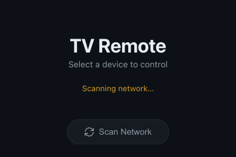
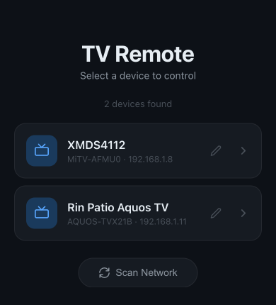
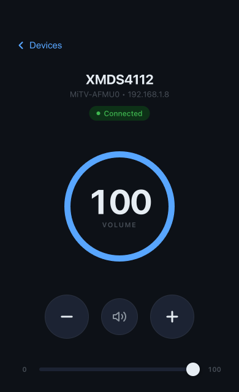

# TV Remote Control

A web-based remote control for any Google Cast-enabled TV on your local network.

## Screenshots







## Features

- Discovers all Google Cast-enabled TVs on the local network via mDNS (Sharp, Samsung, LG, Xiaomi, Sony, and more)
- Control volume up, down, and mute for any selected TV
- Precise volume adjustment with a slider
- Assign custom aliases/nicknames to TVs, persisted across restarts
- Works from any browser on the same network (phone, laptop, tablet)
- Zero-dependency discovery using raw mDNS queries (no Bonjour or Avahi required)
- Persistent Cast connections for fast, responsive control

## Prerequisites

- **Node.js** v18 or later
- Your device and TV(s) must be on the **same WiFi network**

## Installation

```bash
git clone https://github.com/your-username/tv-remote-control.git
cd tv-remote-control
npm install
npm start
```

The server starts on `http://localhost:3000`. Open that URL from any device on the same network.

## Usage

1. Open `http://localhost:3000` (or your machine's local IP) in a browser.
2. Click **Scan** to discover Cast-enabled TVs on the network.
3. Select a TV from the list.
4. Use the volume buttons, slider, or mute toggle to control it.
5. Optionally rename a TV with a custom alias -- the name persists in `aliases.json`.

## How It Works

1. **Discovery** -- The server sends a raw mDNS query for `_googlecast._tcp.local` over UDP multicast (port 5353). Every Cast-enabled device on the network responds with its friendly name, model, and IP address.
2. **Control** -- When you interact with a TV, the server opens a persistent connection using the Cast v2 protocol (`castv2-client`) and issues volume get/set commands directly to the device.
3. **Aliases** -- Custom nicknames are stored in `aliases.json` at the project root, keyed by IP address.

## Project Structure

```
tv-remote-control/
  server.js            # HTTP server entry point (port 3000)
  package.json         # Project metadata and dependencies
  aliases.json         # Persisted TV nicknames (auto-generated)
  public/
    index.html         # Single-page browser UI
  src/
    routes.js          # HTTP request handler and API endpoints
    discovery.js       # mDNS device discovery over UDP multicast
    cast.js            # Cast v2 connection management and volume control
    aliases.js         # Read/write alias storage
```

## License

MIT
